# RightSpot

## Description
This was the third project completed as part of the General Assembly SEI Bootcamp. The goal of the project was to create a web app with full CRUD (create, read, update, delete) functionality. Django was to be used for the server, with a PostgreSQL database. Drawing inspiration from the  issues some of my friends faced when opening a cafe, I wanted to create a user-friendly app that could assist entrepreneurs with selecting a location for their business by providing useful statistical data compiled from multiple sources, all in one place.

## Deployment link
The project is hosted [here](https://rightspot.fly.dev/).

## Project Setup Instructions
1. Clone the project repository:
```bash
git clone https://github.com/andy-ag/RightSpot.git
```

2. Navigate to the root directory of the project:
```bash
cd RightSpot
```

3. Create a virtual environment for the project:
```bash
python -m venv env
```

4. Activate the virtual environment:

On Linux/Mac:
```bash
source env/bin/activate
```
On Windows:
```bash
env\Scripts\activate
```

5. Install the required dependencies:
```bash
pip install -r requirements.txt
```

6. Set up environment variables:
Create a .env file in the RightSpot app directory of the project and add the required environment variables.

The variables are listed in the prerequisites, or you can copy the .env copy file and modify it with your values.

7. Run the database migrations:
```bash
python manage.py migrate
```

8. Create a superuser account:
```bash
python manage.py createsuperuser
```

Follow the prompts to enter your username, email, and password.

9. Start the development server:
```bash
python manage.py runserver
```

10. View the website:

Open your web browser and navigate to http://localhost:8000/ to view the website.

## Technologies Used
This project used Django for the back-end. PostgreSQL was used for the database, and the front-end was done with HTML (Django templating) / CSS (Bootstrap, Sass) / JavaScript. I also used pandas and Jupyter Notebook to prepare the core dataset. I used Figma for the wireframing, and GitHub Projects for subtask allocation and organisation.

## Brief
The technical requirements for the project can be found below. There were no restrictions on the subject and scope of the app.

The project **must**:
  - Be a full-stack Django application.
  - Connect to and perform data operations on a PostgreSQL database.
  - If consuming an API, have at least one data entity in addition to the built-in User model. The related entity can be either a one-to-many (1:M) or a many-to-many (M:M) relationship.
  - If not consuming an API, have at least two data entities in addition to the built-in User model. It is preferable to have at least one one-to-many (1:M) and one many-to-many (M:M) relationship between entities/models.
  - Have full-CRUD data operations across any combination of the app's models (excluding the User model). 
  - Authenticate users using Django's built-in authentication.
  - Implement authorization by restricting access to the Creation, Updating & Deletion of data resources.
  - Be deployed online.

## Planning
The idea for this project was born in my mind after watching my friends struggle with the choice of location for their proposed start-up. They were faced with a shortage of quantifiable information about candidate locations, and found it difficult to go off anything other than intuition and some extremely basic directional analysis. I thought that a tool which could help entrepreneurs in similar situations would be quite useful. 

After thinking of the underlying idea, we wanted to come up with a list of features that a user would expect to see when using the app. Implementing the full set of features that the app would have in an ideal world in one week would be impossible, so we narrowed them down to a core set - a user can search for any location and be presented with business-relevant data about it, compiled from multiple sources. A location can then be saved and (optionally) added to a project. A user’s locations and projects would have a many-to-many relationship, and can be updated and deleted at will. A project shows the user the locations associated with it, and allows a user to add notes. A user can also use the ‘Compare’ page to access information about two locations side-by-side.

After deciding on the appropriate feature set, we produced wireframes and an ERD. The app ended up matching the wireframe quite closely, and the ERD only needed minor tweaks to accommodate the specific implementation of the desired functionality that we ended up with.

Below are side-by-side comparisons of the wireframes and the final product.

Landing page:  
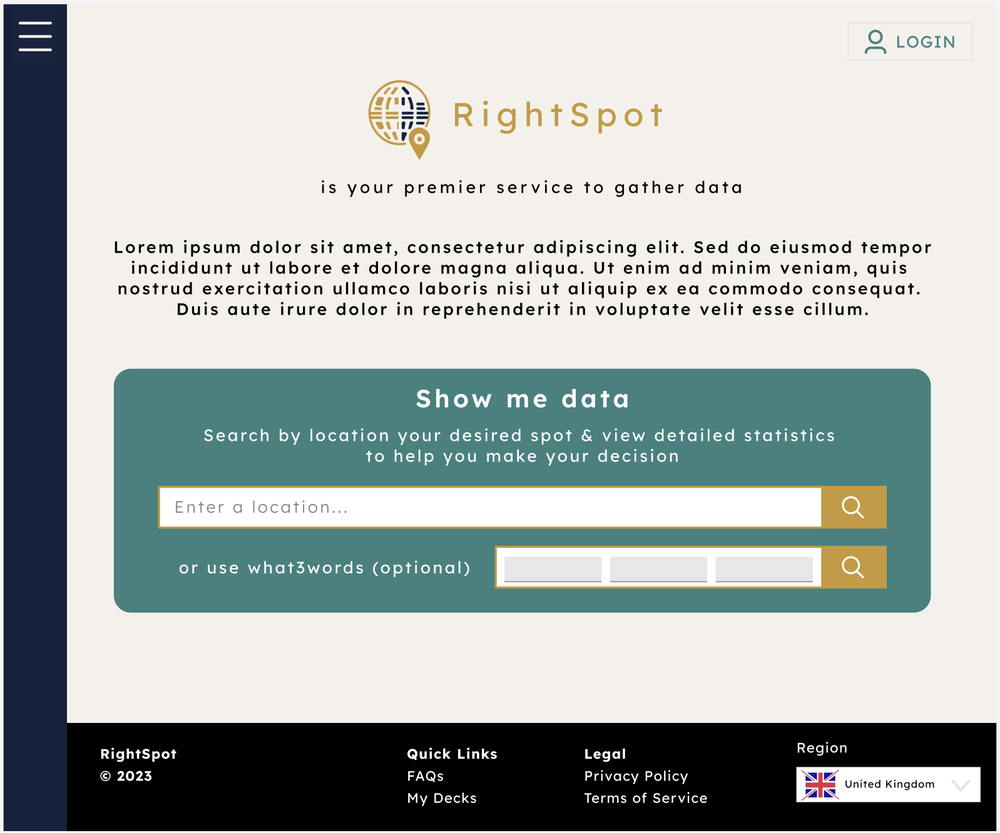 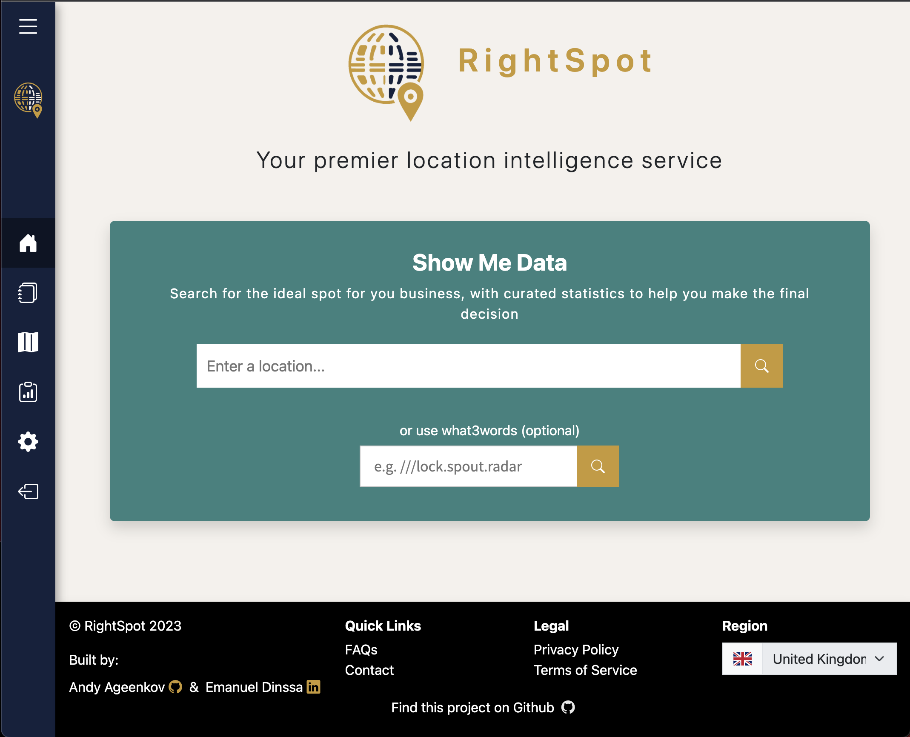

Location details:  
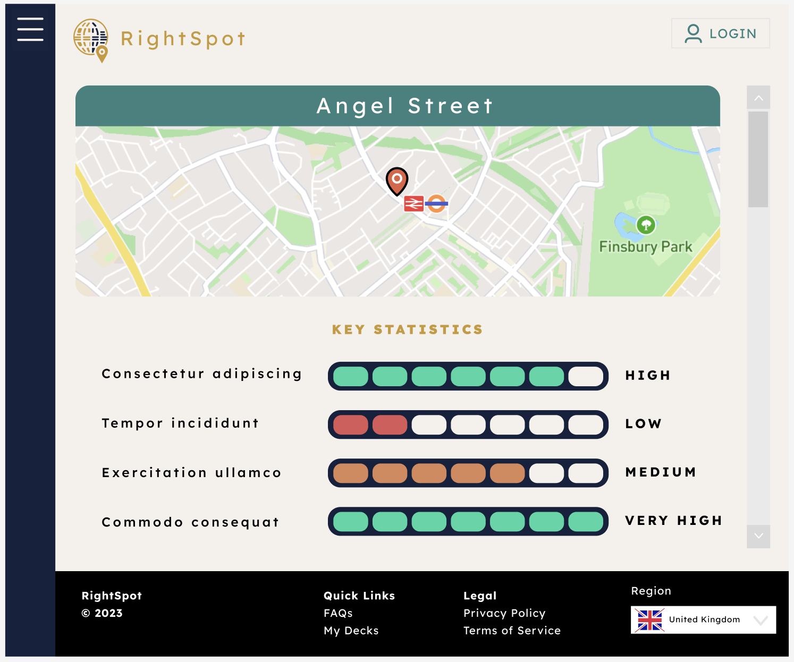 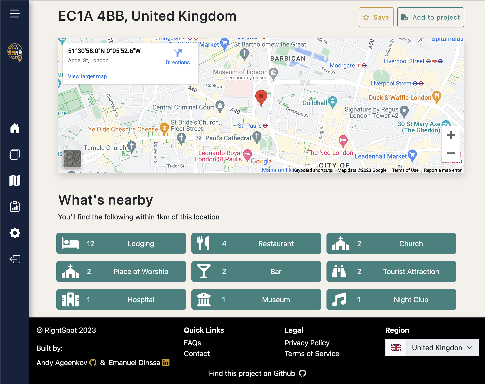

Saved locations:  
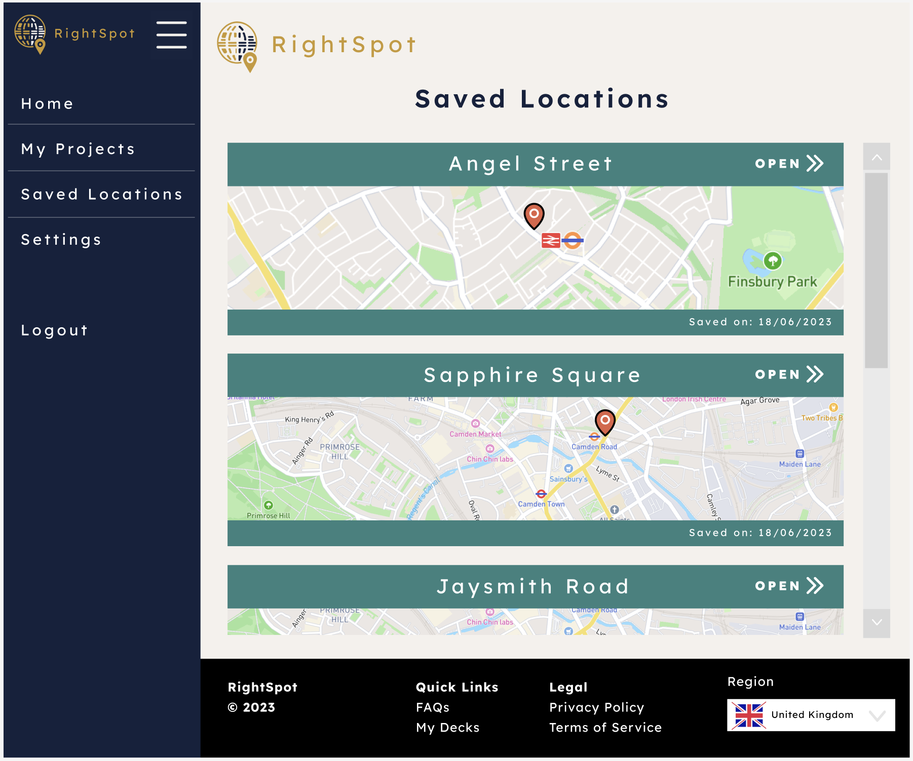 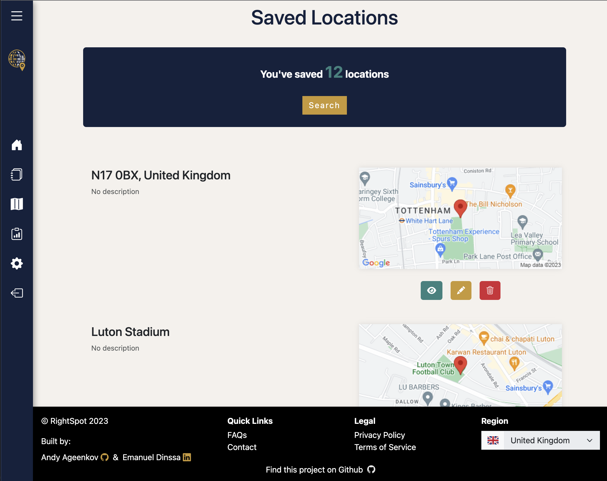

Projects:  
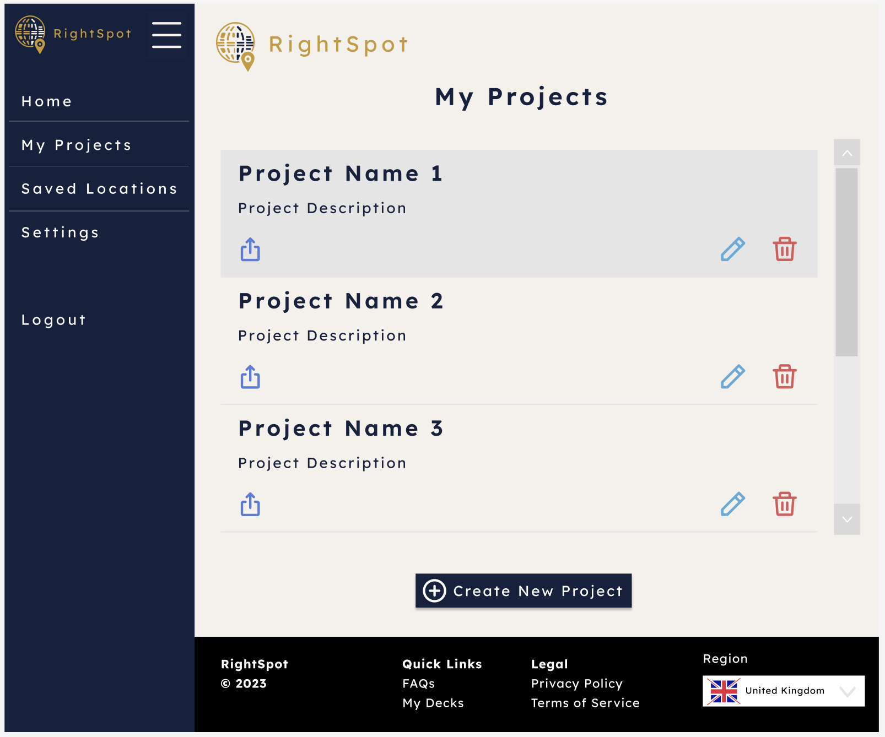 

Project details:  
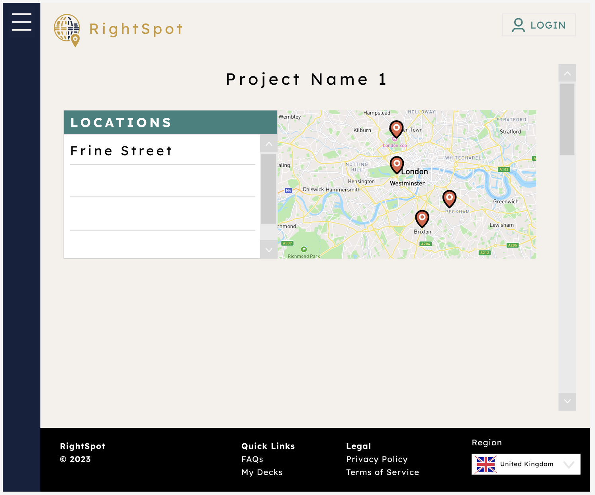 

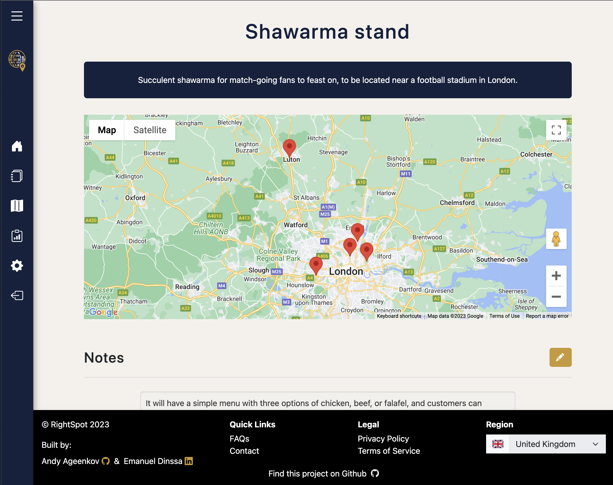
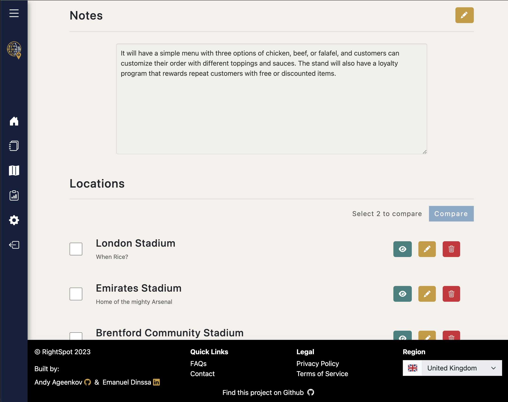

We did not assign rigid roles and responsibilities from the outset, but agreed instead to have a daily standup where we would calibrate our mutual understanding of the current state of the project, as well as both tactical and strategic next steps.

Despite the lack of a formal allocation, there was an understanding that the two of us had different strengths that would inform task distribution in principle. My teammate had more experience with (and an affinity for) front-end development. Conversely, I am more interested in back-end development, and also have experience working with datasets obtained during my MSc in Statistics. In practice, this is exactly what happened - I took responsibility for everything involving our static dataset, and a large part of the back-end, while my teammate took charge of the front-end and picked up ad-hoc tasks.

## Build process
The first order of business was creating the skeleton for the Django app. I created the folder structure, stubbed up the list of URLs for routing along with their related views (Django’s term for controllers as conceptualised in the MVC framework) and HTML templates, as well as the models for our key data entities - locations and projects. After this was complete, we could proceed with work on the app in separate feature branches, with the completed skeleton eliminating any potential ambiguity with regards to folder and file structure.

The next task was to prepare the static database that we would use to provide the statistical data based on selected location to the user. We decided to use data from the ONS (Office for National Statistics, UK) for this purpose, as it offers a wide range of useful indicators tracked regularly and with quite a low-level geographic granularity - administrative districts - perfect for the purposes of our app. The specific datasets I compiled into our static database can be found in the first FAQ on the website.

This was the most time consuming and challenging single task that I undertook as part of this project. In addition to the time demands of obtaining and cleaning the data, and later preparing it for display to the user, there were also non-trivial conceptual decisions to be made regarding the choice of constituent datasets, the methods of obtaining the data, the desired structure of the compiled dataset.

After selecting the specific indicators from each dataset that I deemed to comprise a most-informative subset of all the available data, I wrote a script that used the ONS API to download these individual datasets.

main_app/static_data/data_getter.py
```python
import requests
import os
import time
import pandas as pd
import re

def get_data(base_url, subdirectory_name, filename_prefix, output_filename, request_num):
    directory = os.path.dirname(os.path.abspath(__file__))
    save_directory = os.path.join(directory, subdirectory_name)
    os.makedirs(save_directory, exist_ok=True)
    counter = 0
    for i in range(0,request_num,25000):
        print(f"Sending API request with RecordOffset={i}")
        url = f"{base_url}{i}"
        response = requests.get(url)
        if response.status_code == 200:
            filename = f"{filename_prefix}{counter}.csv"
            counter += 1
            file_path = os.path.join(save_directory, filename)
            with open(file_path, 'wb') as file:
                file.write(response.content)
                print(f'Saved {filename} successfully.')
        else:
            print(f'Error occurred while making the API call: {response.status_code}')
        time.sleep(0.5)    

    output_filepath = os.path.join(directory, output_filename)
    joined_data = pd.DataFrame()

    file_names = [filename for filename in os.listdir(save_directory) if filename.endswith('.csv')]
    file_names.sort(key=lambda x: int(re.findall(r'\d+', x)[0]))

    for filename in file_names:
        file_path = os.path.join(save_directory, filename)
        df = pd.read_csv(file_path)
        if joined_data.empty:
            joined_data = df
        else:
            joined_data = pd.concat([joined_data, df.iloc[1:]], ignore_index=True)

    joined_data = joined_data.reset_index(drop=True)
    joined_data.to_csv(output_filepath, index=False)
    print(f"Exported to '{output_filepath}' successfully.")
```

After the datasets were obtained, they needed to be manipulated to have a uniform format, to facilitate a smooth merge into the final static dataset. To achieve this, I used pandas within a Jupyter Notebook. Below is an example cleaning for one dataset (8 total).

main_app/static_data/ons-data-cleaning.ipynb
```python
import pandas as pd
from new_dict import name_reformat, column_reformat, date_reformat, fert_reformat, h_e_reformat, business_counts_reformat, business_register_reformat, disposable_income_reformat, jobs_density_reformat, population_reformat

aps = pd.read_csv('ready_data/aps-districts-joined.csv')
aps = aps[aps.MEASURES_NAME == 'Variable']
del aps['MEASURES_NAME']
del aps['OBS_STATUS_NAME']
aps = aps.replace({"VARIABLE_NAME": name_reformat, "DATE_NAME": date_reformat})
aps.rename(columns=column_reformat, inplace=True)
aps.reset_index(drop=True, inplace=True)
aps.head(10)
```

After the dataset was compiled, I made the decision to convert it from a long data format to a wide one. The intuition behind this choice was that when querying data for a user it would be more efficient to request c. 10 rows (one for each year of data for a given location), than c. 8000 rows in the long format.

main_app/static_data/ons-data-cleaning.ipynb
```python
# Construct full dataset
final_dataset = pd.DataFrame
datasets = [aps, h_e, business_counts, business_register, fertility, population, jobs_density, disposable_income]
for dataset in datasets:    
    if final_dataset.empty:
        final_dataset = dataset
    else:
        final_dataset = pd.concat([final_dataset, dataset.iloc[1:]], ignore_index=True)     

reshaped = pd.pivot(final_dataset, index=['district', 'date'], columns='indicator', values='value')
reshaped.fillna(0, inplace=True)
reshaped.to_csv('rightspot_wide.csv')
```

Once the dataset was finalised and ready to integrate into the project, I needed to create the respective Django model that would be used to house it in a PostgreSQL database. This posed a challenge, since the c. 800 fields in it were not particularly amenable to the traditional manual declaration of a Django model class. Instead, the fields were constructed dynamically using the headers on the CSV file containing our data.

main_app/models.py
```python
# Create Django model using .csv file headers as fields
csv_file_path = 'main_app/static_data/rightspot_wide.csv'

with open(csv_file_path, 'r') as csv_file:
    reader = csv.reader(csv_file)
    headers = next(reader) 

model_fields = {}

for column_name in headers[2:]:
    model_fields[column_name] = models.DecimalField(max_digits=10, decimal_places=2) 

model_fields['district'] = models.CharField(max_length=300)
model_fields['date'] = models.IntegerField()

class Meta:
    app_label = 'main_app'

model_attrs = {
    '__module__': __name__,
    'Meta': Meta,
    **model_fields,
}

StaticOnsData = type('StaticOnsData', (models.Model,), model_attrs)
```

Once the model was migrated, I wrote a Django management command that populates the database with the contents of the CSV file. Conceptually, this was an elegant approach to take, as it is a command that needs to be run several times a year at most, and so is a prime candidate to move from the main code folders, maintaining a separation of concerns. This is an approach that we tried to maintain throughout the project, in order to create a cleaner and easily navigable codebase. Creating a management command was also an example of the ways in which I tried to take advantage of the customizability of Django’s class-based structure.

main_app/management/commands/loadcsvdata.py
```python
import csv
from decimal import Decimal
from django.core.management.base import BaseCommand, CommandError
from django.db import transaction
from main_app.models import StaticOnsData  

# Management command for a one-off transfer of data from a .csv file to the database
# Run with python manage.py loadcsvdata

class Command(BaseCommand):
    help = 'Load data from CSV into the database'

    def handle(self, *args, **options):
        csv_file_path = 'main_app/static_data/rightspot_wide.csv'

        with open(csv_file_path, 'r') as csv_file:
            reader = csv.reader(csv_file)
            headers = next(reader)

            model_fields = {name: 'decimal' for name in headers}
            model_fields['district'] = 'char'
            model_fields['date'] = 'int'

            try:
                with transaction.atomic():
                    for row in reader:
                        entry_data = dict(zip(headers, row))

                        # Convert values to the appropriate type.
                        for field_name, field_type in model_fields.items():
                            if field_type == 'decimal':
                                entry_data[field_name] = Decimal(entry_data[field_name])
                            elif field_type == 'int':
                                entry_data[field_name] = int(entry_data[field_name])

                        instance = StaticOnsData(**entry_data)
                        instance.full_clean()
                        instance.save()

            except Exception as e:
                raise CommandError('Failed to load data: %s' % e)

            self.stdout.write(self.style.SUCCESS('Successfully loaded data from "%s"' % csv_file_path))
```

Once the dataset was snug inside our PostgreSQL database, I got to work on one of the main user-facing features of the app - the detail page that a user is taken to after searching for a location. The server-side logic behind the page was in essence a set of calls to the APIs that we set up as part of the web-app, manipulating the flow of information starting from a user’s request and ending at the set of information to be displayed to them, with some processing mixed in (semantic separation of indicators into three groups - demographic, socioeconomic, and industrial, number formatting). The ordering of the variables took a lot of time, as there was no way of getting around the need to comb through the set of variables and manually select the variable order. Both the initial datasets and hence the combined one suffered from a somewhat chaotic variable order, that was hard to intuitively navigate as a user, so the re-ordering was unavoidable.

```python
def location_detail(request):
	location_name = request.GET.get('gQuery') or request.GET.get('what3words_3wa')
		
	geocode_url = get_api_base_url(request) + '/location_services/geocode'
	geocode_params = {'query': location_name}
	geocode_data = fetch_from_api(geocode_url, geocode_params)
	if not geocode_data:
			return redirect('home')
		
	lat = geocode_data['lat']
	lon = geocode_data['lng']
		
	# Fetch nearby places
	nearbyplaces_url = get_api_base_url(request) + '/location_services/nearbyplaces'
	nearbyplaces_params = {'lat': lat, 'lng': lon, 'radius': 1000}
	nearbyplaces = fetch_from_api(nearbyplaces_url, nearbyplaces_params)
	if not nearbyplaces:
			return redirect('home')
	
	# Fetch address details
	geodetails_url = get_api_base_url(request) + '/location_services/geodetails'
	geodetails_params = {'lat': lat, 'lng': lon}
	addressparts = fetch_from_api(geodetails_url, geodetails_params)
	if not addressparts:
			return redirect('home')
		
	# Get district name for ONS data matching
	district = check_uk_district(addressparts)
	
	stats = None
	comparison_variables_dict = {}
	if district:
			# Fetch ONS data
			ons_url = get_api_base_url(request) + '/data/ons'
			ons_params = {'query': district}
			stats = fetch_from_api(ons_url, ons_params)
			for year_data in stats['data']:
						for variable, value in year_data.items():
								formatted_value = format_value_as_integer_or_dash(value)
								year_data[variable] = formatted_value
			for year_data in stats['data']:
				year = year_data['date']
				comparison_variables_dict[year] = []
				for variable, value in year_data.items():
					if variable in comparison_variables:
						comparison_variables_dict[year].append({variable: value})
	location = {
			'query': geocode_params['query'],
			'coords': (lat, lon),
			'address': addressparts,
			'nearby': nearbyplaces,
			'comparison': comparison_variables_dict
	}
	
	return render(request, 'locations/detail.html', {
					'name': f"{location['address']['postcode']}, {location['address']['country']}",
					'stats': stats,
					'names': inverse_names,
					'demographics': demographics_final_order_list,
					'socioeconomics': socioeconomics_final_order_list,
					'industry': industry_final_order_list,
					'nearby': tallyPlaces(nearbyplaces),
					'location': location,
					'projects': Project.objects.filter(user=request.user) if isinstance(request.user, User) else None,
					'google_api_key': env('GOOGLE_MAPS_API_KEY'),
	})
```

I also had to create the ONS data API that was to be called in this function, while my teammate handled the other ones. We set the APIs up as separate apps to be mounted onto the project - another example of the separation of concerns that we implemented as part of this project.

Folder structure: 

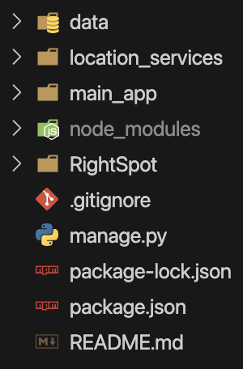 

data/views.py
```python
@api_view(['GET'])
def ons(request):
    query = request.GET.get('query')
    if query:
        try:
            stats = StaticOnsData.objects.filter(district=query)
            data = []
            for stat in stats:
                data_point = {
                    'date': stat.date,
                    'district': stat.district
                }
                for field_name, field_value in stat.__dict__.items():
                    if field_name not in ['date', 'district', '_state']:
                        data_point[field_name] = field_value
                data.append(data_point)
            return JsonResponse({'data': data}, safe=False)
        except Exception as e:
            return JsonResponse({'error': str(e)}, status=400)
```

While working on the front-end for the detail page, I also made use of Django’s flexibility to write custom template tags that would assist me where out-of-the-box solutions were not readily available (or apparent to me at the time). These turned out to be a worthwhile investment, as I ended up re-using them later on for a different page.

main_app/templatetags/getvalue.py
```python
from django import template

register = template.Library()

# Allows Django template to use dynamic keys
@register.filter
def getvalue(dictionary, key):
    return dictionary.get(key)
```

main_app/templatetags/json.py
```python
from django import template
from django.utils.html import escapejs
import json

register = template.Library()

@register.filter(is_safe=True)
def escapejs_json(data):
    return escapejs(json.dumps(data, ensure_ascii=False))
```

After the detail page was complete, I created the locations index page, where all of a user’s saved locations would be displayed. Once this was done, I tweaked the Location and Project models to implement the many-to-many relationship, and added save, update and delete functionality for both. Here I once again modified the built-in Django functionality to better suit our needs.

main_app/views.py
```python
class LocationUpdate(LoginRequiredMixin, UpdateView):
    model = Location
    form_class = LocationUpdateForm
    def get_form_kwargs(self):
        kwargs = super(LocationUpdate, self).get_form_kwargs()
        kwargs['user'] = self.request.user
        return kwargs

    def form_valid(self, form):
        self.object = form.save(commit=False)
        projects = form.cleaned_data.get('projects', [])
        self.object.projects.set(projects)
        self.object.save()
        next_url = self.request.GET.get('next')
        return redirect(next_url) if next_url else redirect('saved_location_detail', location_id=self.object.id)

class LocationDelete(LoginRequiredMixin, DeleteView):
    model = Location
    def get_success_url(self):
        next_url = self.request.GET.get('next')
        return next_url if next_url else '/locations/starred'
```

main_app/forms.py
```python
class LocationUpdateForm(forms.ModelForm):
    projects = forms.ModelMultipleChoiceField(queryset=Project.objects.none(), widget=forms.CheckboxSelectMultiple())

    def __init__(self, *args, **kwargs):
        user = kwargs.pop('user', None)
        super(LocationUpdateForm, self).__init__(*args, **kwargs)
        if user:
            self.fields['projects'].required = False
            self.fields['projects'].queryset = Project.objects.filter(location__user=user).distinct()
            if self.instance:
                self.fields['projects'].initial = self.instance.projects.all()

    class Meta:
        model = Location
        fields = ['name', 'description', 'projects'] 
```

The next feature I worked on was another key element of the app - the ability for a user to compare two saved locations. I made the decision to include a few headliner variables that I deemed most impactful for this comparison. This hard-coded selection was done in the interest of time, and seen as a better alternative to simply including all the data, which would have made the page very busy, and worked against the smooth UX that we tried to maintain throughout the app.

I wrote a JS script that would dynamically populate the page with information about the two selected locations, with UI refinements that initialise the drop-downs to a neutral ‘Pick a location’ field, and restrict the set of available options to exclude a location that is already selected for comparison.

main_app/static/js/compare.js
```javascript
// Script to handle selection of data from drop-downs for comparing two locations
// Can take preset locations from query parameters:
// /compare?left=location1.id&right=location2.id

document.getElementById("left-location-select").addEventListener("change", updateComparison);
document.getElementById("right-location-select").addEventListener("change", updateComparison);

document.getElementById("left-location-select").addEventListener("change", () => filterLocations('left', 'right'));
document.getElementById("right-location-select").addEventListener("change", () => filterLocations('right', 'left'));

// Check if location IDs are passed as URL parameters and set the selectors
document.addEventListener("DOMContentLoaded", function() {
    const leftLocationId = getUrlParameter('left');
    const rightLocationId = getUrlParameter('right');

    // Only select locations if IDs are passed in URL parameters
    if (leftLocationId) {
        document.getElementById("left-location-select").value = leftLocationId;
    } else {
        document.getElementById("left-location-select").value = "";
    }

    if (rightLocationId) {
        document.getElementById("right-location-select").value = rightLocationId;
    } else {
        document.getElementById("right-location-select").value = "";
    }

    // Filter initial dropdowns to avoid duplicate locations
    filterLocations('left', 'right');
    filterLocations('right', 'left');

    if (leftLocationId && rightLocationId) {
        updateComparison();
    }
});


function formatWithCommas(number) {
    return number.toString().replace(/\B(?=(\d{3})+(?!\d))/g, ",");
}

function getUrlParameter(name) {
    const regex = new RegExp('[\\?&]' + name + '=([^&#]*)');
    const results = regex.exec(location.search);
    return results === null ? '' : decodeURIComponent(results[1].replace(/\+/g, ' '));
};

function filterLocations(source, target) {
    const sourceSelect = document.getElementById(`${source}-location-select`);
    const targetSelect = document.getElementById(`${target}-location-select`);
    const selectedLocationId = sourceSelect.value;
    const currentTargetSelected = targetSelect.value;

    // Save the current options except the selected one
    let optionsHtml = '<option value="" disabled>Select a location</option>';
    locations_j.forEach(location => {
        if (location.pk.toString() !== selectedLocationId) {
            optionsHtml += `<option value="${location.pk}"${location.pk.toString() === currentTargetSelected ? ' selected' : ''}>${location.fields.name}</option>`;
        }
    });

    // Update the options of the target dropdown
    targetSelect.innerHTML = optionsHtml;
    
    // Ensure that if there is no location selected, the 'Select a location' option remains selected
    if (!currentTargetSelected) {
        targetSelect.value = "";
    }
}
    
function updateComparison() {
    const leftLocationId = document.getElementById("left-location-select").value;
    const rightLocationId = document.getElementById("right-location-select").value;

    const leftLocation = locations_j.find(location => location.pk == leftLocationId);
    const rightLocation = locations_j.find(location => location.pk == rightLocationId);

    const leftComparison = leftLocation.fields.location.comparison;
    const rightComparison = rightLocation.fields.location.comparison;

    const leftTableBody = document.getElementById("left-location-data");
    const rightTableBody = document.getElementById("right-location-data");

    leftTableBody.innerHTML = '';
    rightTableBody.innerHTML = '';

    const years = Object.keys(leftComparison).sort((a, b) => b - a);
    years.forEach(year => {
        leftComparison[year].forEach(entry => {
            const variable = Object.keys(entry)[0];
            let leftRawValue = entry[variable];
            let leftValue = (leftRawValue && variable !== 'date') ? parseFloat(leftRawValue) : leftRawValue;

            const rightEntry = rightComparison[year].find(e => Object.keys(e)[0] == variable);
            let rightRawValue = (rightEntry ? rightEntry[variable] : null);
            let rightValue = (rightRawValue && variable !== 'date') ? parseFloat(rightRawValue) : rightRawValue;

            const leftRow = document.createElement("tr");

            if (variable === 'date') {
                leftRow.style.setProperty("--bs-table-bg", "#C89933");
            }

            const leftVariableCell = document.createElement("td");
            const leftValueCell = document.createElement("td");
            const leftArrowCell = document.createElement("td");

            leftVariableCell.classList.add("text-center")
            leftValueCell.classList.add("text-center")
            leftArrowCell.classList.add("text-center")

            leftVariableCell.textContent = names[variable];


            if (leftValue > rightValue) {
                leftArrowCell.innerHTML = '<span style="color:green">▲</span>';
            } else if (leftValue < rightValue) {
                leftArrowCell.innerHTML = '<span style="color:red">▼</span>';
            } else if (leftValue !== 0 && leftValue === rightValue) {
                leftArrowCell.innerHTML = '<span style="color:#C89933; font-weight:900;">=</span>';
            }

            leftRow.appendChild(leftVariableCell);
            leftRow.appendChild(leftValueCell);
            leftRow.appendChild(leftArrowCell);
            leftTableBody.appendChild(leftRow);

            if (rightEntry) {
                const rightRow = document.createElement("tr");

                if (variable === 'date') {
                rightRow.style.setProperty("--bs-table-bg", "#C89933");
                }

                const rightArrowCell = document.createElement("td");
                const rightValueCell = document.createElement("td");
                const rightVariableCell = document.createElement("td");

                rightVariableCell.classList.add("text-center")
                rightValueCell.classList.add("text-center")
                rightArrowCell.classList.add("text-center")

                rightVariableCell.textContent = names[variable];

                if (variable === 'date') {
                    leftValueCell.textContent = leftValue;
                    rightValueCell.textContent = rightValue;
                } else {
                    leftValueCell.textContent = (!leftRawValue || isNaN(leftValue)) ? '-' : formatWithCommas(leftValue);
                    if (rightEntry) {
                        rightValueCell.textContent = (!rightRawValue || isNaN(rightValue)) ? '-' : formatWithCommas(rightValue);
                    }
                }

                if (rightValue > leftValue) {
                    rightArrowCell.innerHTML = '<span style="color:green">▲</span>';
                } else if (rightValue < leftValue) {
                    rightArrowCell.innerHTML = '<span style="color:red">▼</span>';
                } else if (leftValue !== 0 && leftValue === rightValue) {
                    rightArrowCell.innerHTML = '<span style="color:#C89933; font-weight:900;">=</span>';
                }

                rightRow.appendChild(rightArrowCell);
                rightRow.appendChild(rightValueCell);
                rightRow.appendChild(rightVariableCell);
                rightTableBody.appendChild(rightRow);
            }
        });
    });
}

updateComparison();
```

At this point, the core functionality of the app was done, and we worked dynamically throughout the final day to polish and bug-test all of the app’s features, ensuring that everything works as intended, and making adjustments where an opportunity for improvement was spotted. 

The final touch was writing up the FAQs section, as well as the Terms of Service and Privacy Policy, and with that my first collaborative web-app was complete.

## Challenges
The most challenging aspect of the project was working with the underlying data. As it was a cornerstone of our project, I set out to finalise the dataset and get it into our database immediately. This task turned out to be more time-consuming than I expected, with certain subtasks demanding a large degree of fundamentally non-automatable work (selecting the subset of useful variables to retain, creating a semantically meaningful ordering of the variables for display), and others being elegant, but conceptually non-trivial - instantiating a c. 800-field Django model without manually entering the desired field names and types, for instance.

Another challenge, at times, was working with Git. It was my first experience of working in a shared repo, and I spent longer than I would have liked on getting familiar with resolving merge conflicts, and especially resolving the ensuing issues when a merge was incorrectly made (despite my best efforts). The upside of these intermittent struggles was that I am now much more confident in resolving conflicting merges.

Apart from the aforementioned issues, the rest of the work went quite smoothly. This is not to say that local technical challenges did not arise, but rather that they were within the bounds of expectation, and resolved in due time by using the vast resources of the internet. Furthermore, we were able to collectively prevent many issues from arising by communicating effectively and being extremely transparent about our respective workflows. 

## Wins
A big strategic win was creating a fully functioning, useful and polished app within a week, while working in a team for the first time. I took heterogeneously structured data from 8 different datasets, cleaned and compiled it into one large static dataset, and then implemented a way to effectively query it from user input and display the results in an intuitive way. All this was wrapped in a smooth web-app with a great UI and all the QoL features the demanding modern user is accustomed to.

The ability to work effectively in a team was a cornerstone of this project, and is as such a win in its own right. Through effective communication and efficient collaboration, we were able to maintain a clear local separation of responsibilities, and avoid duplicating any work, which allowed us both to perform at the high end of our capabilities.

## Key Learnings/Takeaways
This was the first software development project that I completed as part of a team, and was thus a valuable learning opportunity. I was glad to confirm that my prior experience of working within project teams in a workplace context translated seamlessly to this task.

I once again saw clearly the crucial role that effective communication plays in any team effort. My teammate and I set a policy of proactive communication on Slack outside of scheduled standups - if you finished a meaningful subtask, share it; if you are moving on to another task, share it; if you are experiencing unforeseen difficulties and need to slightly recalibrate the completion estimate, share that too. The attentional overhead incurred by seeing such messages is almost negligible, but they go a long way towards a shared understanding of the project’s progress, and any associated calibrations in task allocation / prioritisation that need to be made.

This policy allowed us to be flexible in our allocation of relatively minor tasks, making our use of time as efficient as possible - imperative given the tight deadline.

In terms of technical takeaways, I was able to become quite comfortable with the basics of Django. I also managed to push further than what was covered during the lessons in the bootcamp, including writing my own custom template tags, management scripts, modifying the preset form classes for updating database information. This gave me a taste of the flexibility you can get with Django, in addition to its core feature of making the set-up of a web-app lighting fast and painless.

## Bugs
The location update page sometimes omits the most recently added project from the set of available projects to add the location to. In such cases, the user is still able to add it to a project via the ‘Add to project’ button on the detail page, or via a project update page, however it is obviously a bug that deserves to be investigated.

## Future Improvements
There are a few obvious improvements that can be made to the project without changing the core functionality. Adding new data sources for a more complete picture of the location on its detail page is one such improvement. This could either take the form of adding similarly geographically-scoped (district-level) information for countries other than the UK, using their respective statistical bodies as sources of data, or adding more data on a different granularity level. Going upwards from districts, The World Bank provides a wide range of country-level indicators that could comprise a useful section on the page, and if we aim lower, there exist additional sources of POI data other than the Google Places API that could be seamlessly integrated for a richer user experience.

Adding the option to select a location by interacting with an embedded map would be another possible improvement, and having the maps optionally delimit the areas for which data is currently being shown would also be a QoL improvement.

With regards to the location comparison page, an extension would be allowing a user to select any subset of variables for comparison, rather than only the one we pre-selected (the motivation for pre-selecting a small set of variables was discussed previously).

In terms of additional features, one that we initially discussed was the ability of a user to construct an interactive dashboard of personally selected data for a location. Such a dashboard could also include a set of automated analytics in the form of graphs and tables. The elements on these dashboards could be selected and rearranged at will, with the option to convert them to a slide deck.

This functionality could be useful to entrepreneurs pitching their idea in search of funding, for example. Going further in this direction, an API pipeline could be set up to feed a standardised prompt based on the information available about the location to an LLM, that could then be used as a paragraph within the aforementioned slide deck. Given that the LLM would be able to generate an acceptable variance of responses between different locations (rather than a functionally identical description each time), this could be a crucial piece of time-saving technology.